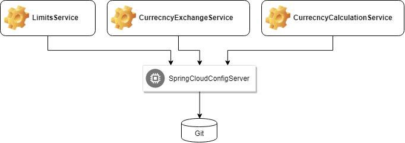

# Spring Microservices

### Limits Service
- [http://localhost:8080/limits](http://localhost:8080/limits)

### Cloud Config Server

### git-localconfig
- ALWAYS new changes must be commited, to be accessible
- `/cloudconfigserver/git-localconfig/limits-service.properties`

#### Limits Service Environments
- [http://localhost:8888/limits-service/default](http://localhost:8080/limits/default)
- [http://localhost:8888/limits-service/dev](http://localhost:8080/limits/dev)
- [http://localhost:8888/limits-service/qa](http://localhost:8080/limits/qa)
- [http://localhost:8888/limits-service/stage](http://localhost:8080/limits/stage)
- [http://localhost:8888/limits-service/product](http://localhost:8080/limits/product)

### Currency Exchange Service
- [http://localhost:8000/](http://localhost:8000)
- [http://localhost:8000/currency-exchange/from/EUR/to/USD](http://localhost:8000/currency-exchange/from/EUR/to/USD)

#### H2 Database
- `data.sql` contains some dummy data
- use [http://localhost:8000/h2-console](http://localhost:8000/h2-console) to view the database
	- Dirver Class: org.h2.Driver
	- JDBC URL: jdbc:h2:mem:testdb
	- User Name: sa
	- Password:

### Currency Conversion Service
After a request on [http://localhost:8100/currency-convertor/from/{from}/to/{to}/quantity/1000](http://localhost:8100/currency-convertor/from/{from}/to/{to}/quantity/1000), `from` and `to` parameters will be sent to **CES** [http://localhost:8000/currency-exchange/from/{from}/to/{to}](http://localhost:8000/currency-exchange/from/{from}/to/{to}), where has the database of the `conversionMultiple` value. Then the response will be calculated in **CCS**.